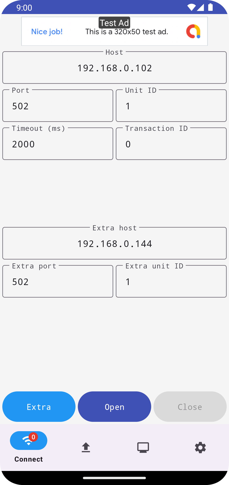
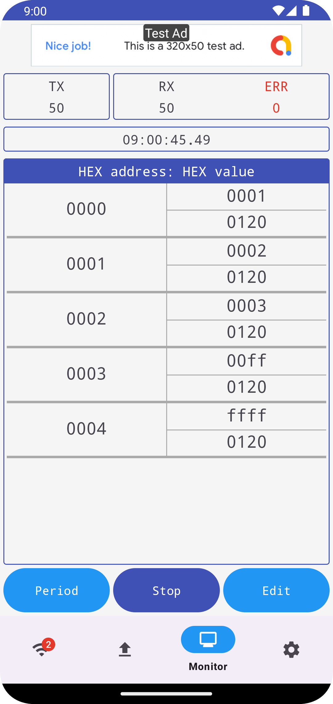

# Modbus TCP Client

    
    
    

## How it works

### Version 2

1. To monitor two servers simultaneously, click the **Extra** button. To open sockets, click the buttons **Open**, **Send** or **Poll**. When one of the sockets is closed, click the **Open** button to open it again.
1. Depending on the function code, enter and send necessary information. Separate data with blanks. The app takes care of the rest, such as transaction ID, protocol ID, data quantity and byte count.
1. The history saves 5 requests in total. If a request is sent successfully, it will be saved in the history automatically.
1. The app collects the last request to check a response. If a response with different transaction ID arrives, it will fail to check.
1. The app takes a response with multiple data frames as an error.
1. The log displays 100 lines and collects 300 lines at most.
1. When polling is activated, select a value and click the **Edit** button to write a coil or a holding register.

### Version 1

1. To open a socket, click the buttons **Open**, **Send** or **Poll**.
1. Depending on the function code, enter and send necessary information. Separate data with blanks. The app takes care of the rest, such as transaction ID, protocol ID, data quantity and byte count.
1. To save a request in the memory slots **M1**, **M2**, **M3**, **M4** or **M5**, click the **Save** button.
1. The app collects the last 100 requests to check responses. If a response with larger transaction ID arrives first, it will fail to check a response with smaller transaction ID.
1. The app takes a response with multiple data frames as an error.
1. The log displays 100 lines at most. The unlimited log only affects the number of lines which the app collects.